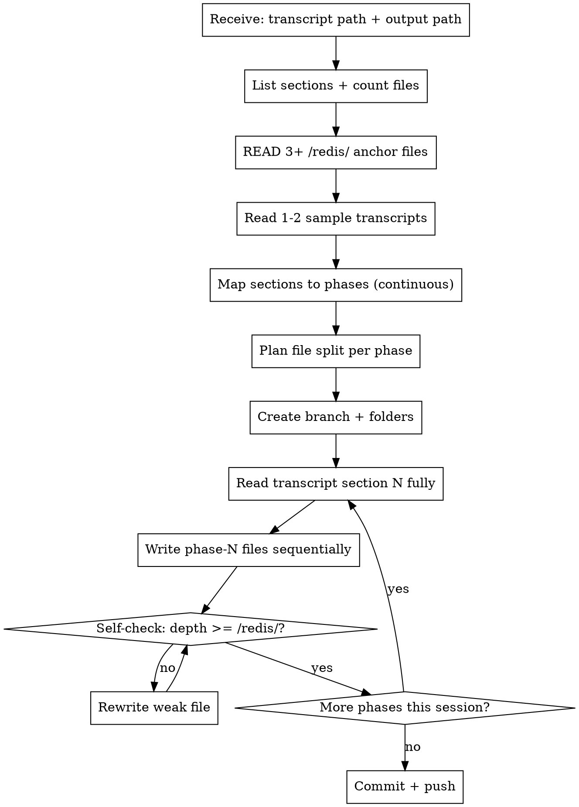

# Transcript-to-Teaching

## Overview

Convert auto-transcribed video lesson folders into a **deep, production-grade Vietnamese teaching curriculum** organized into phases. Output must be significantly deeper than the transcript — the goal is "learner masters and applies in real work", not "transcript translated".

**Reference standard**: every output emulates the depth, structure, and voice of `/redis/` in this workspace. Before writing the first file, ALWAYS read 2-3 files from `/redis/` to anchor style.

**Iron Law: content quality is the metric.** Don't be efficient at the cost of depth. Don't produce shallow files just to finish faster.

## When to Use

- User says "dùng skill này cho transcript ở `<folder-A>`, viết vào folder `<folder-B>`" (or similar).
- User points at a transcript folder under `/transcripts/<course-slug>/` containing section subfolders with `.txt` lessons.

**Don't use when:**
- User asks for a summary, blog post, or single document.
- Source is already polished documentation (not raw auto-transcript).

## Default Inputs (Ask If Missing)

- **Transcript path**: e.g. `/transcripts/<course-slug>/`
- **Output folder**: e.g. `/<course-name>/` at workspace root
- **Scope this session**: how many sections (1-3 typical, full course is many sessions)

Everything else has sensible defaults — don't pile up questions.

## Mandatory First Steps (Every Session)

```
1. List transcript folder → count sections, note gaps in numbering.
2. READ at least 3 files from /redis/ as style anchor:
   - /redis/phase-1/01-redis-la-gi.md          (concept intro pattern)
   - /redis/phase-2/03-set-options.md          (deep API/option file)
   - /redis/phase-3/03-redis-design-methodology.md  (methodology file)
3. Read 1-2 transcript files from target section to understand source quality.
4. Map sections → phases (continuous numbering, skip gaps in transcript).
5. Plan file split for each phase before writing (file count, topics).
```

These steps are not optional. Skipping them produces shallow, inconsistent content.

## Section → Phase Mapping

- Transcripts may have gaps (e.g. no Section 04). Use **continuous numbering**: phase-1 = first existing section, phase-2 = next, etc.
- Each phase folder: `phase-N/` at output root.
- Note any skipped source section in the phase intro file (transparency).

## File Naming

- Format: `NN-kebab-case-vietnamese-slug.md`
- Examples: `01-redis-la-gi.md`, `03-cac-loai-deployment.md`, `06-string-ranges-bitops.md`.
- Number prefix `NN` = order within phase, padded to 2 digits.
- Slug: meaningful Vietnamese, not transliteration of English.

## Files Per Phase

| Transcript section size | Suggested file count |
|---|---|
| 3-4 lessons (small section) | 3-5 files (combine intros) |
| 5-8 lessons (medium) | 5-7 files |
| 10-14 lessons (large) | 7-10 files (group by sub-theme) |

Don't blindly map 1 lesson → 1 file. **Combine when lessons are tiny intros; split when one lesson covers many concepts.**

## File Length Target

- **150-350 lines per file**. Anything under 100 lines is suspect — likely combined wrong or too shallow.
- Match depth of `/redis/` files (avg ~255 lines). Going shorter = lower quality.

## Content Depth Requirements (Non-Negotiable)

Every file MUST include:

1. **Hook**: motivational opener (real problem the lesson solves, or provocative question).
2. **Concepts** với term Anh kèm VN — KHÔNG assume reader biết thuật ngữ. Mỗi technical term được giải thích lần đầu xuất hiện.
3. **ASCII diagrams** cho data flow, structure, request/response, comparisons. Vẽ bằng `text` code block.
4. **Comparison tables** cho mọi list có > 3 option/case.
5. **Production-grade code** (Python / JS / Java / Go tuỳ ngữ cảnh) — không chỉ CLI snippets.
6. **Trade-off section**: "khi nào KHÔNG dùng / hạn chế / mặt trái". Transcript hiếm khi có; bạn phải tự thêm.
7. **Real-world use case** kèm pseudo-code production pattern.
8. **Bẫy thường gặp / anti-patterns** — bảng "sai vs đúng" hoặc list ngắn có giải thích.
9. **Internal mechanism / why it works that way** — append lazy expiration, single-thread event loop, listpack encoding, etc. Đào sâu để người học hiểu, không chỉ học vẹt.
10. **Performance numbers** kèm con số thực (latency, throughput, memory).
11. **Tóm tắt cuối bài**: 3-5 bullet take-away.
12. **Link "Bài kế tiếp"** ở dòng cuối → bài tiếp theo. Phá vỡ chain = lỗi nghiêm trọng.

Each file should feel **complete in itself** — a learner can read just one file and gain a coherent piece of knowledge.

## Bonus Content (Beyond Transcript)

Actively add when relevant:
- **History**: vì sao công nghệ được thiết kế như vậy.
- **Production cluster / scale**: dù transcript nói single-instance.
- **Security gotchas**: với mọi tool dùng mạng/auth.
- **Cross-comparison**: so với SQL, so với competitor (Memcached, ElasticSearch...).
- **Internal data structure**: cách lib/server thực thi lệnh.
- **Modern alternatives / module ecosystem**.

## Voice & Style

- **Tone**: vietnamese, viết như đang giải thích cho đồng nghiệp mới — không kiểu "giáo trình khô khan", không kiểu "blog đại trà".
- **Câu ngắn, ý tập trung**. Bullet và bảng nhiều, không lan man.
- **Đậm/nghiêng** dùng tiết kiệm cho điểm quan trọng.
- **Code block** có comment **chỉ khi giải thích why**, không comment what (well-named identifier đã rõ).
- **Tránh emoji** (trừ khi user xin).
- **Không sao chép câu chữ transcript** — auto-dịch hay sai. Đọc, hiểu, viết lại bằng kiến trúc của mình.

## File Template (Copy-Paste Friendly)

```markdown
# Bài N: [Tiêu đề ngắn gọn, motivational, không generic]

[1-2 đoạn hook — vấn đề thực tế / câu hỏi gợi tò mò, KHÔNG kiểu "trong bài này chúng ta sẽ học..."]

## [Khái niệm cốt lõi — heading mô tả nội dung, không generic]

[Định nghĩa term Anh — VN. Có thể có sub-section ## phân nhỏ.]

[Bảng so sánh / diagram ASCII nếu phù hợp.]

## [Cú pháp / API / Cách dùng]

```text
# Code block với output thực tế
LỆNH key value
→ kết quả
```

[Giải thích từng phần, return code, complexity, edge case.]

## [Đào sâu — internal mechanism / why]

[Trade-off, edge case, cách lib/server thực sự xử lý.]

## [Use case thực tế trong production]

[Pattern kèm pseudo-code ngôn ngữ phù hợp.]

## [Bẫy thường gặp / Anti-pattern]

| Bẫy | Tránh bằng cách |
|---|---|
| ... | ... |

## Tóm tắt bài N

- 3-5 bullet take-away cốt lõi.

**Bài kế tiếp** → [Bài N+1: ...](NN+1-slug.md)
```

## Style Anchors — Files To Re-Read Every Session

Before writing, read these to calibrate depth/voice:

| File | Pattern type to absorb |
|---|---|
| `/redis/phase-1/01-redis-la-gi.md` | Concept intro + comparison + history + use case map |
| `/redis/phase-1/02-vi-sao-redis-nhanh.md` | "Why" deep-dive với reasoning chain |
| `/redis/phase-2/03-set-options.md` | API option-by-option deep-dive |
| `/redis/phase-2/07-lam-viec-voi-so.md` | Race condition explanation với ASCII diagram |
| `/redis/phase-3/03-redis-design-methodology.md` | Methodology / mental model file |
| `/redis/phase-3/05-implement-page-caching.md` | Code-along implementation file |
| `/redis/phase-4/01-hash-la-gi.md` | Data type introduction file |
| `/redis/phase-5/02-hgetall-empty-object.md` | Gotcha deep-dive file |

If output looks shallower than these, **rewrite — don't ship**.

## Git Workflow (Output Persistence)

```bash
# 1. From main, create a new branch named after the course
git checkout main
git checkout -b <course-name>     # e.g. kafka, grpc, nginx-deep

# 2. After writing content for the session, single commit
git add <output-folder>/ transcripts/<transcript-folder>/
git commit -m "Add <Course> learning content - phase-N, phase-N+1 (topics)"

# 3. Push branch to remote
git push -u origin <course-name>
```

**Each session = at minimum one commit + push**. If session covers multiple phases, can also commit per phase if logical chunks emerge.

**If branch already exists** (continuing prior session): checkout it, add new phases, commit, push.

## Process Flow



## Execution Mode — Sequential Only

**Always write phase-by-phase yourself**. No parallel subagents.

Reasons:
- Consistent voice across files.
- "Bài kế tiếp" chains stay correct (depend on next file existing with expected slug).
- Cross-references between phases stay accurate.
- Quality > speed.

If session is too big for available context, do fewer phases per session — don't parallelize.

## Quick Reference — Common Decisions

| Situation | Action |
|---|---|
| Transcript has 1-2 sentence intro lesson | Don't create a dedicated file; fold into next file's hook |
| Transcript has 10+ lesson section | Plan 7-9 files grouped by sub-theme, not 1:1 mapping |
| Section absent from numbering (gap) | Continuous numbering, note gap in phase intro |
| Auto-transcribe garble (vd "read us" → Redis, "yet" → GET) | Silently correct, never quote verbatim |
| Code snippets in transcript use contrived examples | Replace with production-realistic pattern |
| Transcript mentions only CLI usage | ALWAYS add equivalent code in mainstream language |
| Transcript doesn't mention concurrency/scale/security | Add the missing dimension yourself if relevant |
| File draft < 100 lines | Probably too shallow — expand or merge |
| File draft > 400 lines | Probably should split |

## Common Mistakes To Avoid

| Mistake | Fix |
|---|---|
| Copying transcript prose verbatim | Rewrite in your own structure |
| Writing in English | All teaching content **must be Vietnamese** (terms Anh kèm VN) |
| Skipping terminology explanations | Define every technical term at first use |
| Shallow files (< 150 lines) | Combine adjacent or expand with bonus content |
| Missing "Bài kế tiếp" link | Always add — chains the curriculum |
| Generic headings ("Introduction", "Conclusion") | Use content-describing headings |
| Files reading like blog posts | Should read as **reference/textbook**, scannable |
| No ASCII diagrams when flow exists | Add — diagrams cement understanding |
| No comparison table when 3+ options | Add table |
| Code without expected output | Always show what command produces |
| No production trade-offs | Add "khi nào KHÔNG dùng" subsection |
| Forgetting to commit + push | Final step every session |
| Emojis | Don't use unless user asks |
| Comments in code that explain what (not why) | Remove — naming + structure should be self-evident |

## Deliverables Checklist (End of Session)

- [ ] New folder `/<output-folder>/` (or extension of existing) with phase subfolders.
- [ ] Each phase has 3-10 files, all Vietnamese, 150-350 lines each.
- [ ] Every file ends with `**Bài kế tiếp** → [...]` link (except phase summary may link to next phase).
- [ ] Every technical term explained in Vietnamese on first use.
- [ ] Every file has ASCII diagram or comparison table where applicable.
- [ ] Every file has trade-off / "khi nào KHÔNG dùng" section.
- [ ] Production code samples (not just CLI).
- [ ] Branch `<course-name>` exists, content committed, pushed to remote.
- [ ] User notified: phases done, what remains, est. for next session.

## Self-Verification Before Reporting Done

Compare your output against `/redis/` files:
- Line count comparable? (within ±50% range)
- Same structure (hook → concepts → API → deep-dive → use case → bẫy → tóm tắt → bài kế tiếp)?
- Same level of terminology unpacking?
- Diagrams + tables present?
- Production code present?

If any answer is "no" — **rewrite the weak file before committing.**
