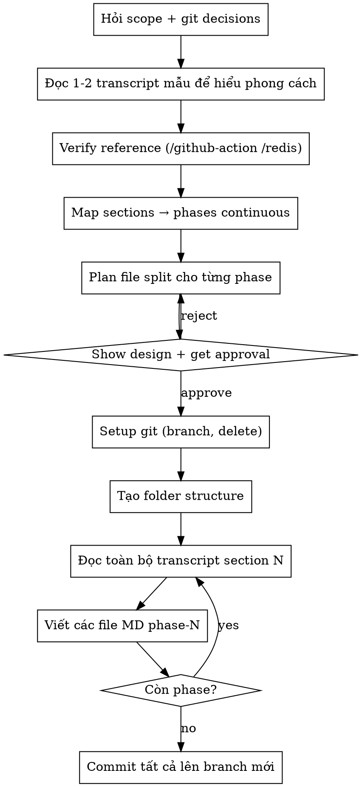

# Transcript-to-Teaching Conversion

## Overview

Convert auto-transcribed video lesson folders into structured Vietnamese teaching content. Output is deeper than the transcript (adds advanced/production knowledge, terminology, trade-offs) and follows the existing pattern in `/github-action/` and `/redis/`.

**Core principle:** Each transcript section (e.g. `Section 01 - Get Started Here!/`) becomes a phase folder (`phase-1/`). Each phase contains multiple short MD files. Content depth > transcript; goal is "learner can master and apply", not "summary".

## When to Use

- User points at a `/transcripts/<course-slug>/` folder with section subfolders containing `.txt` transcripts.
- User asks to create a sibling folder with teaching content (e.g. `redis/`, `nginx/`, `kafka/`).
- User references the existing `/github-action` or `/redis` pattern explicitly.

**Don't use when:**
- User wants a summary, blog post, or single document — this skill produces multi-file teaching curriculum.
- Source is well-written documentation (not raw auto-transcript) — different editorial needs.

## Mandatory Pre-Work Checklist

Before touching any file, gather these answers (use AskUserQuestion if ambiguous):

| Decision | Default if user says "as before" |
|---|---|
| Scope (how many sections this session) | Ask — task is too big for one session, usually 1-3 sections |
| Section numbering with gaps | **Continuous numbering** (phase-N = nth existing section, skip missing) |
| Git: branch strategy | New branch named after course (`redis`, `nginx`...) from main |
| Git: branches to delete | Push unbacked-up branches to remote first, then `git branch -D` only ones with remote backup |
| Git: dirty WT handling | Commit script/transcript changes together with new content in single commit on new branch |

## Phase Folder Conventions

- **Folder name**: `phase-1`, `phase-2`, ... continuous.
- **File name**: `NN-kebab-case-vietnamese-slug.md` (e.g. `01-redis-la-gi.md`, `03-cac-loai-deployment.md`).
- **File count per phase**: 3-8 typically. Combine when transcript lessons are tiny intros; split when one lesson has many concepts.
- **Line count per file**: 150-350 lines (sâu hơn nhiều so với github-action ~50-100 line mẫu).

## File Structure Template

Each MD file follows this Vietnamese teaching template:

```markdown
# Bài N: [Tiêu đề ngắn gọn, motivational]

## [Hook: vấn đề thực tế / câu hỏi gợi tò mò]
1-2 đoạn dẫn vào.

## [Khái niệm cốt lõi]
- Định nghĩa term Anh — VN.
- Bảng so sánh nếu cần.
- Diagram ASCII nếu phù hợp.

## [Cú pháp / API / Cách dùng]
Code block ngắn + output thực tế.

## [Đào sâu / Why does it work]
Trade-off, edge case, internal mechanism (lazy expiration, single-thread, etc.)

## [Use case thực tế trong production]
Pattern phổ biến + pseudo-code.

## [Bẫy thường gặp / Anti-pattern]
Bảng "sai vs đúng" hoặc list ngắn.

## Tóm tắt bài N
- 3-5 bullet take-away cốt lõi.

**Bài kế tiếp** → [Bài N+1: ...](NN+1-slug.md)
```

## Content Depth Rules

**Always include:**
- Giải thích **mọi thuật ngữ** (term Anh kèm VN, không assume biết).
- **Trade-off** + "khi nào KHÔNG dùng" (transcript hiếm khi đề cập).
- **So sánh với cách làm SQL/khác** khi áp dụng (giúp người mới có anchor).
- **Diagram ASCII** cho concepts có dòng chảy (request flow, data structure).
- **Bảng** cho mọi cái có > 3 option/case.
- **Pseudo-code production** ở ngôn ngữ phù hợp (Python/JS/Go), không chỉ CLI.
- **Liên kết bài trước/sau** ở cuối file (`→ [Bài N+1](NN+1-slug.md)`).

**Bổ sung ngoài transcript:**
- Lịch sử ngắn của công nghệ (để hiểu vì sao thiết kế vậy).
- Mặt trái / what could go wrong in production.
- Hiệu năng kỳ vọng kèm số thực (benchmark, p50/p99).
- Cluster / scale considerations dù transcript không đề cập.
- Security gotchas (đặc biệt với DB/network tool).

**Tránh:**
- Sao chép câu chữ transcript (do auto-dịch hay sai).
- Bỏ qua thuật ngữ vì "ai cũng biết" — viết cho người mới hoàn toàn.
- File quá ngắn (< 100 dòng) — gộp với file kế tiếp.
- Comment dư trong code block.

## Process Flow



## Git Workflow

```bash
# 1. Verify clean / understand dirty WT
git status

# 2. Check local branches that need deleting — for each, verify remote backup
git log main..<branch> --oneline
git branch -a | grep <branch>     # check if remote exists

# 3. If branch has unique commits and NO remote backup → push first
git push -u origin <branch>

# 4. Create new branch from main + delete others
git checkout -b <course-name>     # e.g. redis, nginx
git branch -D <old-branch-1> <old-branch-2>

# 5. After writing all content, single commit
git add <course-folder>/ transcripts/<course-slug>/ <any-script-changes>
git commit -m "Add <Course> learning content - phase-1, phase-2, phase-3 (...)"
```

**Safety:** never `git branch -D` a branch that has unique commits not on remote. Always push first.

## Execution Mode — Sequential by Default

**Default mode is sequential** — write phase-by-phase yourself. Reason: user prefers consistent voice, depth, and cross-references across phases. Subagent dispatch produces inconsistent results and breaks "bài kế tiếp" chains.

**Only consider parallel subagents when:**
- User explicitly requests speed over consistency.
- Sections are independent (no concept building forward).
- Context budget tight and remaining work > 10 phases.

If using parallel anyway: each subagent must get path to an existing finished phase (`/redis/phase-1/`) as style anchor, explicit file count, and the full template above.

## Quick Reference — Mappings

| Transcript signal | Your action |
|---|---|
| Section title generic ("Get Started") | Phase intro: setup + motivation + tools |
| Section has 3-5 short lessons | Maybe combine into 3-4 files |
| Section has 10+ lessons | Split into 6-9 files, group by sub-theme |
| Lesson says "Don't skip this" | Important context — keep it in your file |
| Transcript mentions only CLI | Add code example in mainstream language (Python/JS) |
| Transcript uses contrived example | Replace with production pattern |
| Section absent from numbering (e.g. no Section 04) | Use continuous numbering, document the gap |
| Auto-transcribe garble ("read us" → Redis) | Silently correct, never quote verbatim |

## Common Mistakes

| Mistake | Fix |
|---|---|
| Copying transcript prose verbatim | Rewrite in your own structure; transcript is *content reference*, not voice |
| Writing in English | All teaching MD must be in **Vietnamese** (term Anh kèm VN giải thích) |
| Skipping sections silently | Use continuous numbering but mention in the affected phase intro that source section X was missing |
| Short files (< 100 lines) | Combine; aim 150-350 lines per file |
| Forgetting "next bài" link at end | Always add `**Bài kế tiếp** → [...]` (except final file → links to next phase or summary) |
| Committing transcripts under different commit than content | Single commit cleaner; user wants traceability |
| Force-deleting branch without remote backup | `git push -u origin <branch>` FIRST, then `git branch -D` |
| Adding emojis | Don't, unless user asks |

## Anti-Patterns to Avoid

- ❌ Generating shallow "summary" — depth must exceed transcript.
- ❌ Bullet-only files (no prose explanation, no diagrams).
- ❌ Using `KEYS *`, `cat file | grep` style — show production-correct patterns.
- ❌ Skipping the design approval gate.
- ❌ Writing all files before the first commit (lose work if crash); but ALSO don't commit each file (noisy history). One commit per session is the sweet spot.

## Reference Files in This Workspace

Read these to anchor your style and depth before writing:

- `/redis/phase-1/01-redis-la-gi.md` — định nghĩa + so sánh + định vị
- `/redis/phase-2/03-set-options.md` — option deep-dive với pattern
- `/redis/phase-2/07-lam-viec-voi-so.md` — race condition explanation diagram
- `/redis/phase-3/03-redis-design-methodology.md` — methodology bài (most important content type)
- `/redis/phase-3/05-implement-page-caching.md` — code-along bài
- `/redis/phase-2/08-bai-tap-va-loi-giai.md` — exercise + gotchas tổng kết

`/github-action/` exists but is **shallower** (~50-100 line/file); use `/redis/` as the depth target.

## Deliverables Checklist (End of Session)

- [ ] New folder `/<course-name>/` with phase subfolders.
- [ ] N files per phase (3-8 typical), all Vietnamese, 150-350 line each.
- [ ] Every file ends with link to next bài (or summary section if final).
- [ ] Git branch `<course-name>` exists, contains single commit with content + transcripts + script changes.
- [ ] Removed local branches that have remote backup.
- [ ] Working tree clean.
- [ ] User notified of progress (phases done, what's left).
